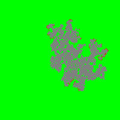
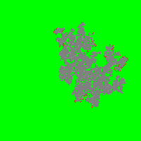

# Ciril-Group-Semulation-Feu-En-Foret
# Simulation de propagation de feu

Ce projet simule la propagation du feu dans une grille en utilisant un modèle probabiliste. Les cases de la grille peuvent être dans l'un des trois états : ARBRE, EN_FEU, ou CENDRE.

## Algorithme

L'algorithme suit les étapes suivantes :

1. **Initialisation** :
    - Créer une grille de taille définie où chaque case est initialement un ARBRE.
    - Définir la probabilité `p` de propagation du feu à une case adjacente.
    - Placer quelques cases initiales en état EN_FEU pour démarrer la simulation.

2. **Simulation** :
    - Pour chaque tour de simulation :
        - Identifier Si les positions des cases actuellement en feu `(x, y)`.
        - Pour chaque case `(X, Y)` en feu :
            - Passer l'état de la case à `CENDRE`.
            - Récupérer les positions adjacentes `ADJX, ADJY` des 4 cases voisines (haut, bas, gauche, droite).
            - Pour chaque case adjacente `(ADJX, ADJY)` :
                - Si `(ADJX, ADJY)` est une position valide dans la grille et que la case `[ADJX, ADJY]` est un `ARBRE` et que `A < p` (où `A` est un nombre aléatoire entre 0 et 1) :
                    - Passer l'état de la case adjacente à `EN_FEU`.
                - Fin Si
            - Fin Pour
        - Fin Pour
    - Fin Si
- Fin

 

